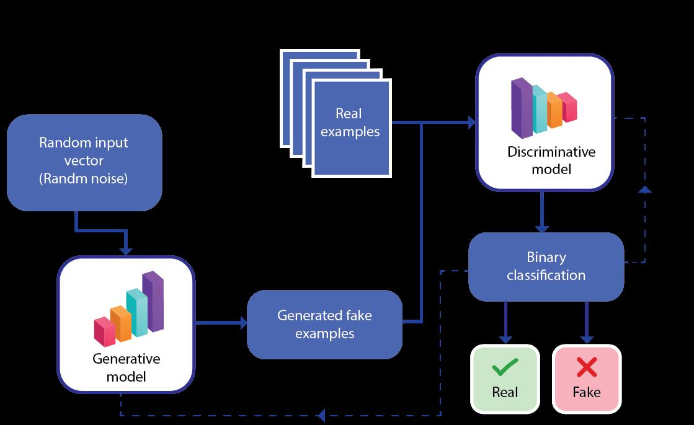

# GENERATIVE AI

This refers to the a category of artificial intelligence (AI) algorithms that generate new output based on the data they have been trained on.

they are designed to:

1. Recognize patterns
2. Make Predictions
3. Create new content in form of images, audios and texts

## GENERATIVE MODEL

it is a model that learns to generate  new data samples that resemble  a givven data set

it captures the underlying patterns and structures that follow same distribution

## DISCRIMINATIVE MODEL

focuses on modeling the boundary or decision surface between different classes or categories in the
data. Discriminative models aim to classify or label data based on its characteristics rather than generating new samples.

## GAN (GENERATIVE ADVERSIAL NETWORKS)

these are types of generative models consisting of two neural networks:

1. A Generator
2. A Discriminator

A Generator creates new samples while discriminator tries to distinguish between the real and the generated samples

These two networks are trained together in a competitive process to improve the quality of the generated samples

## LANTENT SPACE

refers to a lower-dimensional representation learned by a generative model that captures the underlying structure of the data. It represents the essential features or factors of variation in the data and serves as a compact representation that can be used to generate new samples.

## VARIATION AUTOENCODERS

these are generative models that combine elements of both autoencoders and variation inference.

They consist of an encoder network that maps the input data to a lantent space and a decoder network that generates new samples/output from the lantent space

They are trained to maximize the likelihood of generating the original data and can generate new samples/output from the learned distribution

## AUTOREGRESSIVE MODEL

they are often used for generating sequences of text, where the model predicts the next word based on the previous words in the sequence

## DEEPFAKE

it refers to manipulated or synthesized media content i.e images, audio created using generative AI techniques.

DeepFake technology can create highly fake content, which raises concerns about the potential misuse for spreading misinformation or deception.

## CONDITIONAL GENERATION

it involves generating new samples based on a given condition or input.

n text generation, the model can be conditioned on a particular prompt or context to generate relevant and coherent text.

## INFERENCE

it refers to the process of generating new samples from a trained generative model.

## GAN ARCHITECTURE

## HOW GENERATIVE AI WORKS

1. Data collection and pre-processing
2. Model Training
3. Lantent space representation
4. Generation process
5. Evaluation and Refinement

### DATA COLLECTION AND PRE-PROCESSING

collect data sets that represent the kind of content you want to generate.

this data set can consist of:

1. Images
2. Text
3. Audio
4. Any other form of data

this dataset is then preprocessed to ensure it is suitable format and to normalize or transform the data if necessary.

### MODEL TRAINING

A Generative model is trained using a pre-processed data set.

The choice of model depends on the type of data and desired output.

popular models include:

1. Generative Adversial models (GAN models)
2. Variational Autoencoders (VAE models)
3. Autoregressive models

during the training the model learns the underlying patterns and structure in the data, capturing the stastical distribution of the training examples.

### LANTENT SPACE REPRESENTATION

Many generative models learn a latent space representation, which is a lower-dimensional representation that captures the essential features or factors of variation in the data. The latent space allows for easier manipulation and generation of new samples

### GENERATION PROCESS

Once the model is trained, it can generate new content by sampling from the learned distribution

### EVALUATION AND REFINEMENT

The generated content is evaluated based on various metrics, such as visual quality, coherence, or relevance to the desired output. Feedback from the evaluation process can be used to refine the model or guide the generation process. Iterative training and fine-tuning are often employed to improve the quality and diversity of the generated content
