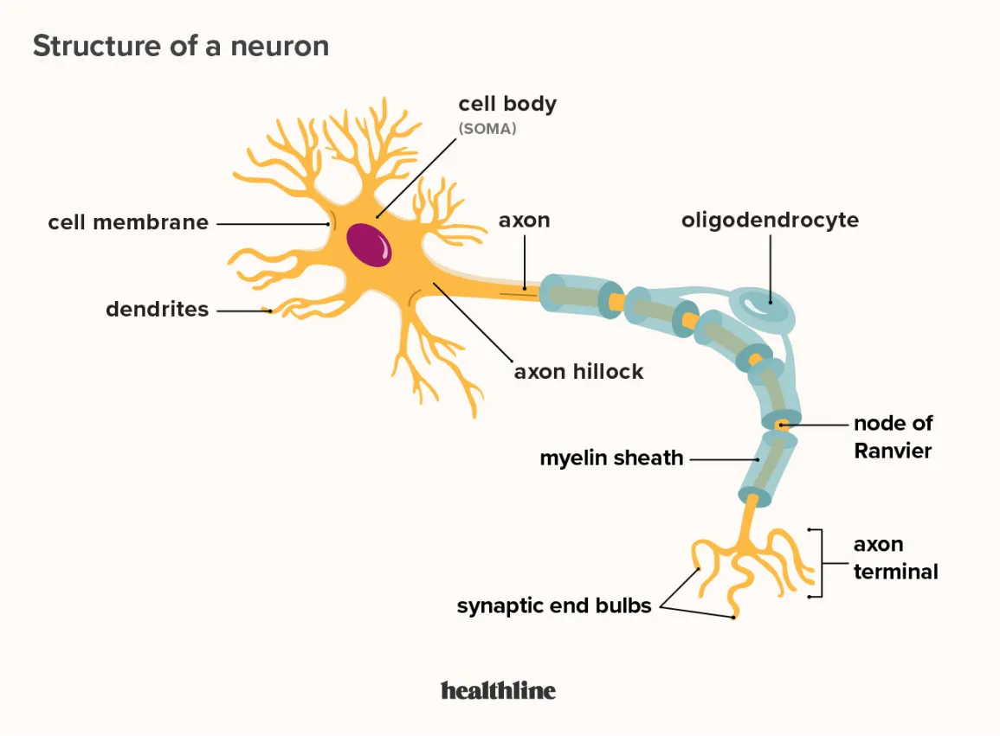

# DEEP LEARNING

Neural networks are inspired by human brain cells.

A neural network uses electronic circuits insipired by way neurons communicate in the human brain.

in the brain, cells called Neurons are made of:

1. nucleus
2. long axon
3. terminals

Neurons communicate with each other by receiving signals into axon, alter those signals then transmit those signals through the terminal into other neurons

in a neural network, a building block called a `perceptron` which acts as an equivalent of a single neuron.

A perceptron has:

1. Input layer
2. Hidden layers
3. Output layer

A signal enters the input layer and the hidden layers run algorithms on the signal. Then, the result is passed to the output layer.

The hidden layers in a neural network resemble, as a group, the long cell body that connects dendrites to axons within a human brain cell. Those hidden layers contain nodes. Each node runs an algorithm and bits of additional code to test and adjust its result. When the value reaches a certain threshold, the node “fires”.

A node often uses a sigmoid function to determine whether or not to “fire”.

If there are other nodes connected to the node, they are activated when the signal reaches them. If the other nodes reach their own thresholds, then they fire. The signal cascades down through the hidden layers in a way that’s somewhat similar to how a signal passes down the body of a human brain cell.
